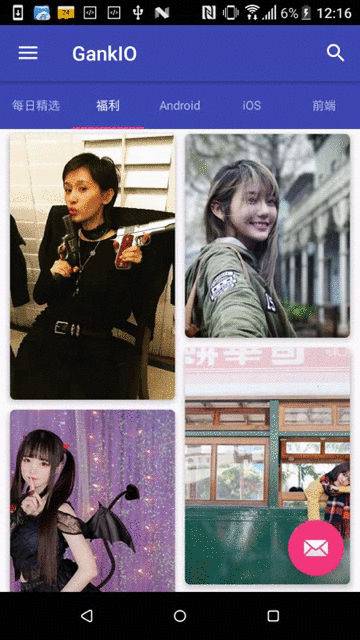

基于 Material Design，使用 MVP + RxJava + Retrofit + ButterKnife 开发干货集中营客户端，接口由[干货集中营](http://gank.io/)提供，非常感谢~

目前 MVP 模式代码已全部合并到 `master` 分支，若要查看非 MVP 模式的代码请在 git 的提交记录中找到 tag `v1.0.0`

如果觉得本项目对您有帮助，欢迎给个 Star 或者分享给小伙伴哦~

## 版本日志

### 2017-03-21 V1.1.0
1. 添加每日精选
2. ViewPager 切换时状态保存
3. 修复一些bug
4. 代码重构

### 2017-03-12 V1.0.0
1. 干货集中营客户端初版

## 待添加功能
1. 保存福利中妹子图到本地
2. 添加缓存
3. 优化交互及每日精选UI
4. 侧滑菜单
5. 适配

## 注意
如果大家在使用过程中出现问题，欢迎提交 issue 或发邮件给我，我会尽快处理

Gmail:1025263614lsj@gmail.com

## 许可
> Copyright 2017 littlejie
>
> Licensed under the Apache License, Version 2.0 (the "License"); you may not use this file except in compliance with the License. You may obtain a copy of the License at
>
> http://www.apache.org/licenses/LICENSE-2.0
>
> Unless required by applicable law or agreed to in writing, software distributed under the License is distributed on an "AS IS" BASIS, WITHOUT WARRANTIES OR CONDITIONS OF ANY KIND, either express or implied. See the License for the specific language governing permissions and limitations under the License.

